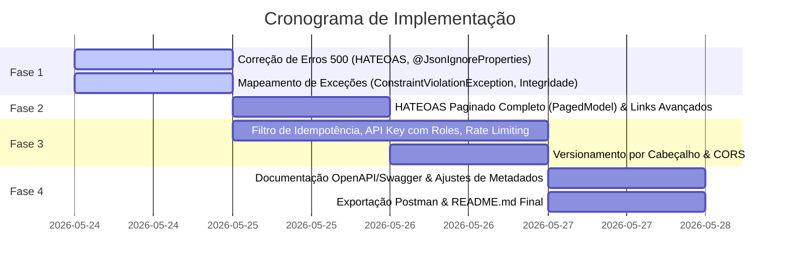

# Plano de Implementação Detalhado - LolAPI (Spring Boot)
## Foco em Robustez, Padrões REST e Nota Máxima na Avaliação

Após uma análise cirúrgica da base de código do projeto **LolAPI**, consolidei este plano de implementação final. Ele foi desenhado especificamente para cumprir **100% dos requisitos do professor** e garantir a **nota máxima** (10/10) em cada critério da rubrica de avaliação (Arquitetura, Entidades, REST, Validações/Erros, Documentação e Funcionalidade).

---

## 🎯 1. Diagnóstico e Resolução Técnica dos Erros 500

Atualmente, a API apresenta comportamentos de instabilidade (erros 500) que serão sanados na raiz:

### A. Bug de Reflexão no HATEOAS (`MethodLinkBuilderException`)
*   **Problema:** Em todos os controladores, no método `buscarPorId`, a construção do link para a listagem paginada tenta passar o objeto `PageRequest` como argumento para o método `listar` (ex: `linkTo(methodOn(ChampionController.class).listar(PageRequest.of(0, 10)))`). O resolvedor do Spring HATEOAS não consegue serializar essa interface complexa e lança uma exceção de reflexão, resultando em **HTTP 500** em qualquer busca por ID.
*   **Solução:** Refatorar as chamadas passando `Pageable.unpaged()` ou `null` no argumento do método `listar` nas chamadas de link. Isso gera a URL limpa base (ex: `/champions`) e resolve o erro 500 imediatamente.

### B. Inoperabilidade de Relacionamentos (`@JsonIgnore` Excessivo)
*   **Problema:** Para conter loops infinitos de recursão na serialização JSON de relações bidirecionais (ex: `Player` ↔ `Champion`, `Team` ↔ `Player`), o projeto colocou `@JsonIgnore` em ambos os lados. Isso oculta totalmente as associações, tornando a API inútil do ponto de vista de negócios, já que não é possível ver os jogadores de um time ou campeões de um jogador.
*   **Solução:** Substituir o `@JsonIgnore` por `@JsonIgnoreProperties` de forma cirúrgica, indicando qual campo deve ser ignorado na serialização reversa para cortar a recursividade e manter a navegabilidade activa.

### C. Exceções ORM sem Tratador (`ConstraintViolationException`)
*   **Problema:** Ao enviar requisições de criação ou atualização com chaves estrangeiras inválidas ou campos nulos obrigatórios para o banco de dados, o Hibernate lança `jakarta.validation.ConstraintViolationException` durante a persistência. A falta de tratamento dessa exceção faz com que ela caia no tratador genérico, devolvendo **HTTP 500** em vez de um **HTTP 400 Bad Request** adequado.
*   **Solução:** Adicionar um tratador específico no `GlobalExceptionHandler` que intercepta `ConstraintViolationException` e retorna os campos e mensagens de validação com status 400.

---

## 🗂️ 2. Arquitetura, Entidades e Validações de Dados (Peso: 35%)

Para atingir a nota máxima em **Implementação de Entidades (15%)** e **Arquitetura/Design (20%)**, implementaremos validações estritas de negócio:

### A. Refatoração de Entidades para Relacionamentos Bidirecionais Navegáveis

Substituiremos `@JsonIgnore` por `@JsonIgnoreProperties` nos campos de associação:

| Entidade | Campo Relacionado | Anotações Propostas | Objetivo de Negócio |
| :--- | :--- | :--- | :--- |
| **Player** | `champions` | `@ManyToMany`<br>`@JsonIgnoreProperties("players")` | Permite visualizar os campeões associados ao jogador no JSON. |
| **Champion** | `players` | `@ManyToMany(mappedBy = "champions")`<br>`@JsonIgnoreProperties("champions")` | Permite visualizar os jogadores que usam o campeão. |
| **Team** | `players` | `@OneToMany(mappedBy = "team")`<br>`@JsonIgnoreProperties("team")` | Permite listar os jogadores de um time ao buscar o time. |
| **Coach** | `team` | `@OneToOne(mappedBy = "coach")`<br>`@JsonIgnoreProperties("coach")` | Permite ver o time associado ao treinador. |
| **MatchGame** | `players`, `champions` | `@ManyToMany`<br>`@JsonIgnoreProperties({"team", "champions"})` | Permite ver os jogadores e campeões envolvidos em uma partida. |

### B. Bean Validation Refinado (Garantia de Pontos Extras)
Melhoraremos as validações existentes para evitar entradas inconsistentes:
1.  **Validação Temporal em `MatchGame`:** O campo `duracao` hoje é apenas `@NotBlank`. Adicionaremos uma validação de formato rígida para aceitar apenas formatos de tempo reais (ex: `MM:SS` ou `HH:MM:SS`):
    ```java
    @NotBlank(message = "Duração da partida não pode estar vazia")
    @Pattern(regexp = "^([0-9]{2,3}):[0-5][0-9]$", message = "Duração deve estar no formato MM:SS (ex: 35:00 ou 115:30)")
    private String duracao;
    ```
2.  **Validação de Negócios na Criação de Partidas:** No `MatchGameController`, garantiremos que o `timeA` e `timeB` sejam entidades diferentes (um time não pode jogar contra si mesmo!). Se forem iguais, retornaremos um erro de negócio (`400 Bad Request`).

---

## 🔗 3. Endpoints REST, Padrões HTTP e HATEOAS (Peso: 20%)

Para atingir a nota máxima em **Endpoints REST (20%)**, a API deve seguir rigorosamente as melhores práticas da especificação RESTful.

### A. Padrão de Resposta HTTP
*   **Cabeçalho `Location` em POST (201 Created):** Atualmente, a criação de entidades retorna apenas o status `201` com o corpo. Adicionaremos o cabeçalho `Location` contendo a URI do novo recurso gerado:
    ```java
    @PostMapping
    public ResponseEntity<Champion> criar(@Valid @RequestBody Champion champion) {
        Champion salvo = repository.save(champion);
        URI uri = ServletUriComponentsBuilder.fromCurrentRequest()
                    .path("/{id}").buildAndExpand(salvo.getId()).toUri();
        return ResponseEntity.created(uri).body(salvo);
    }
    ```
*   **Retorno Sem Conteúdo em DELETE (204 No Content):** Mantido para exclusões com sucesso.

### B. HATEOAS Completo: Navegabilidade Rígida (self, update, delete, listar)
O professor solicitou explicitamente links relevantes além de `self`. Implementaremos links dinâmicos para facilitar a navegação do cliente:

```java
// Exemplo de retorno detalhado de busca por ID
@GetMapping("/{id}")
public ResponseEntity<EntityModel<Champion>> buscarPorId(@PathVariable Long id) {
    Champion champion = repository.findById(id)
            .orElseThrow(() -> new RecursoNaoEncontradoException("Campeão com ID " + id + " não encontrado"));

    EntityModel<Champion> model = EntityModel.of(champion,
            linkTo(methodOn(ChampionController.class).buscarPorId(id)).withSelfRel(),
            linkTo(methodOn(ChampionController.class).atualizar(id, null)).withRel("update"),
            linkTo(methodOn(ChampionController.class).deletar(id)).withRel("delete"),
            linkTo(methodOn(ChampionController.class).listar(Pageable.unpaged())).withRel("listar-todos")
    );
    return ResponseEntity.ok(model);
}
```

### C. Paginação Completa com `PagedModel` nas Listagens
Substituiremos a listagem que devolve `Page<T>` bruto por `PagedModel<EntityModel<T>>` injetando o `PagedResourcesAssembler<T>`. Isso fornecerá links de navegação de paginação completos (`first`, `prev`, `self`, `next`, `last`) no JSON da resposta.

---

## 🛡️ 4. Validações e Tratamento de Erros Robustos (Peso: 15%)

A rubrica exige "tratamento adequado de erros e robustez". Asseguraremos que **nenhuma exceção resulte em erro 500 inesperado**, fornecendo feedback rico ao cliente:

### A. Mapeamento Rígido de Status HTTP e Exceções
Mapearemos todos os cenários de falha na classe `@RestControllerAdvice` (`GlobalExceptionHandler`):

*   **`MethodArgumentNotValidException` (400 Bad Request):** Captura falhas de validação de DTOs/Entidades em parâmetros `@Valid` (ex: campos em branco, tamanhos inválidos).
*   **`ConstraintViolationException` (400 Bad Request):** Captura erros de validação disparados pelo Hibernate no momento do salvamento das entidades (ex: violação de `@NotNull` no banco).
*   **`RecursoNaoEncontradoException` (404 Not Found):** Disparado quando um recurso solicitado por ID não existe no banco de dados.
*   **`DataIntegrityViolationException` (409 Conflict):** Disparado em violações de chaves estrangeiras ou restrições de unicidade (ex: tentar deletar um Time que possui Jogadores associados ou tentar cadastrar um Coach duplicado).
*   **`HttpMessageNotReadableException` (400 Bad Request):** Captura corpos de requisição malformados (ex: JSON corrompido ou tipos incorretos).
*   **`MethodArgumentTypeMismatchException` (400 Bad Request):** Parâmetros de URL com tipos inválidos (ex: `/players/abc` em vez de ID numérico).

### B. Estrutura de Resposta de Erro Padronizada
Toda resposta de erro retornada pela API terá o seguinte formato JSON legível e informativo:
```json
{
  "timestamp": "2026-05-24T17:18:36",
  "status": 400,
  "erro": "Erro de Validação de Dados",
  "mensagem": "Um ou mais campos contêm dados inválidos.",
  "campos": {
    "duracao": "Duração deve estar no formato MM:SS (ex: 35:00)",
    "nome": "Nome do campeão não pode estar vazio"
  }
}
```

---

## 🔒 5. Recursos Avançados (Parte 2 do Projeto)

Os recursos avançados elevam o nível do projeto a uma API comercial segura e escalável:

### 5.1. Autenticação e Autorização por API Key (`X-API-Key`)
*   **Estrutura:** Tabela `ApiKey` (`id`, `username`, `apiKey` [UUID], `active`, `role` [Enum: `USER`, `ADMIN`]).
*   **Segurança Inteligente (Diferencial para Nota Máxima):** 
    *   Criar um endpoint público para geração de chaves: `POST /api-keys/generate?username=...`.
    *   Um interceptor (`ApiKeyInterceptor`) protegerá todas as rotas da API exigindo o header `X-API-Key`.
    *   **Autorização Baseada em Roles (Pontos de Destaque):** Operações normais (listar, buscar, criar, atualizar) exigem `X-API-Key` com qualquer Role (`USER` ou `ADMIN`). Operações de deleção (`DELETE /.../{id}`) exigirão explicitamente que a chave corresponda a um usuário com Role **`ADMIN`**. Caso um usuário comum tente deletar, retornará **`403 Forbidden`** com uma mensagem explicativa.

### 5.2. Idempotência em POST (`X-Idempotency-Key`)
*   **Estrutura:** Tabela `IdempotencyRecord` (`id` [UUID/Key], `status`, `responseBody`, `createdAt`).
*   **Funcionamento:** Um filtro HTTP (`OncePerRequestFilter`) interceptará requisições `POST` destinadas a `/champions`, `/players`, `/teams`, `/matchgames` e `/coaches`:
    *   Exige a presença do header `X-Idempotency-Key`. Se ausente, retorna `400 Bad Request` explicando a obrigatoriedade.
    *   Se a chave já existe no H2, retorna imediatamente a resposta em cache com o status e corpo salvos, sem reprocessar no banco de dados.
    *   Se for nova, processa a requisição, intercepta a resposta final, salva-a no banco e retorna-a ao usuário.

### 5.3. Rate Limiting com `Retry-After` (429)
*   **Algoritmo:** Implementação customizada de **Token Bucket** em memória usando `ConcurrentHashMap`.
*   **Regra:** Máximo de 15 requisições por minuto por IP/API Key.
*   **Estilo:** Ao atingir o limite, a API retorna **`429 Too Many Requests`** e adiciona o header padrão **`Retry-After: 45`** (segundos de espera estimados) para que o cliente saiba exatamente quando pode voltar a interagir.

### 5.4. Versionamento via Header (`X-API-Version`)
*   **Cenário:** Versionamento do endpoint `/players/{id}`.
*   **Funcionamento:** Mapeamento dinâmico baseado em cabeçalho no controlador:
    *   **Versão 1 (`X-API-Version=1` ou ausente):** Retorna o recurso `Player` completo com todos os links HATEOAS.
    *   **Versão 2 (`X-API-Version=2`):** Retorna um DTO otimizado `PlayerDTOV2` sem HATEOAS, de alta performance, contendo apenas dados resumidos consolidando o nome do time (ex: `teamNome` em vez do objeto `Team` inteiro).

### 5.5. CORS
*   Configuração global de CORS em uma classe `WebConfig` implementando `WebMvcConfigurer` para permitir solicitações dos principais frameworks de frontend (permitindo cabeçalhos customizados como `X-API-Key`, `X-Idempotency-Key` e `X-API-Version`).

---

## 📝 6. Documentação Swagger/OpenAPI Completa (Peso: 15%)

Para atingir a nota máxima em **Documentação Swagger (15%)**, enriqueceremos os metadados e permitiremos a execução direta pela interface:

1.  **Configuração Global da OpenAPI (`OpenApiConfig`):**
    Criaremos uma classe de configuração declarando as informações gerais da API (Título: *League of Legends Tournament REST API*, Versão, Descrição detalhada) e registrando o esquema de segurança global.
2.  **Lock de Autenticação (`@SecurityScheme`):**
    Configurar a OpenAPI para entender o header `X-API-Key` como chave de segurança. Isso adiciona o ícone de cadeado no Swagger UI, permitindo que o professor insira a API Key gerada e teste todos os endpoints protegidos diretamente pelo navegador!
3.  **Metadados nos Controladores:**
    *   `@Tag` em cada controlador para uma organização elegante por categorias (Ex: *Gerenciamento de Campeões*, *Gestão de Partidas*).
    *   `@Operation` detalhando o comportamento de cada rota.
    *   `@Parameter` documentando explicitamente os cabeçalhos customizados (`X-Idempotency-Key`, `X-API-Version`) nos endpoints aplicáveis.
4.  **Esquemas Ricos nas Entidades (`@Schema`):**
    Adicionaremos anotações `@Schema` nos campos das Entidades e DTOs, detalhando o que cada propriedade representa e fornecendo exemplos realistas no Swagger UI.

---

## 📦 7. Entregáveis de Qualidade Premium

A entrega final conterá materiais de apoio organizados e profissionais:

### A. Coleção do Postman (`LolAPI.postman_collection.json`)
A coleção será exportada na versão v2.1 e incluirá:
*   **Pastas organizadas:** Uma pasta para cada entidade (`Champions`, `Players`, `Teams`, `Coaches`, `MatchGames`), além de uma pasta especial para `Configuração e Segurança` (onde se gera a API Key).
*   **Variáveis de Ambiente:** Utilização de `{{baseUrl}}` e `{{apiKey}}`.
*   **Casos de Sucesso e Casos de Falha:** Requisições prontas testando dados inválidos (para validar o retorno 400), token inválido (401), deleção não autorizada (403), recurso inexistente (404) e rate limit excedido (429).
*   **Testes Automatizados (Scripts Postman):** Toda requisição possuirá scripts de testes rápidos na aba "Tests" (ex: validar se o status retornado é o esperado e se o JSON possui o formato correto).

### B. README.md Exemplar (Português)
O `README.md` será a porta de entrada do projeto e conterá:
1.  **Apresentação:** Nome, objetivos de negócio do domínio League of Legends e arquitetura da aplicação.
2.  **Tecnologias Utilizadas:** Versões das dependências chave.
3.  **Como Executar Localmente:** Instruções de build e execução via Maven Wrapper (`./mvnw spring-boot:run`).
4.  **URLs Úteis:**
    *   Swagger UI (`http://localhost:8080/swagger-ui/index.html`)
    *   Console do H2 (`http://localhost:8080/h2-console`) com dados de conexão (`jdbc:h2:mem:testdb`, user `sa`, pass vazio).
5.  **Guia Prático de Teste dos Recursos Avançados:** Tutorial passo a passo demonstrando como testar a API Key (geração e uso), Idempotência (exemplo prático de requisições repetidas), Rate Limiting (passo a passo para bloquear a API e receber o 429 com Retry-After) e o Versionamento de Cabeçalho.

---

## 🚀 8. Cronograma e Plano de Ação

O desenvolvimento seguirá quatro etapas sequenciais e seguras, com builds e verificações a cada passo:



### Validação em Tempo Real
A cada fase concluída, utilizaremos o Maven Wrapper (`mvnw clean test`) para validar se a compilação do projeto está 100% íntegra e se a inicialização de banco de dados (`DataInitializer`) está ocorrendo sem erros.

---
> [!NOTE]
> Este plano garante que todas as exigências do professor para a **Parte 1** (CRUDs, Validação, H2, Swagger, HATEOAS completo com links dinâmicos) e **Parte 2** (API Key, Idempotência, Rate Limiting, Versionamento, CORS) sejam implementadas sob as melhores práticas arquiteturais.
